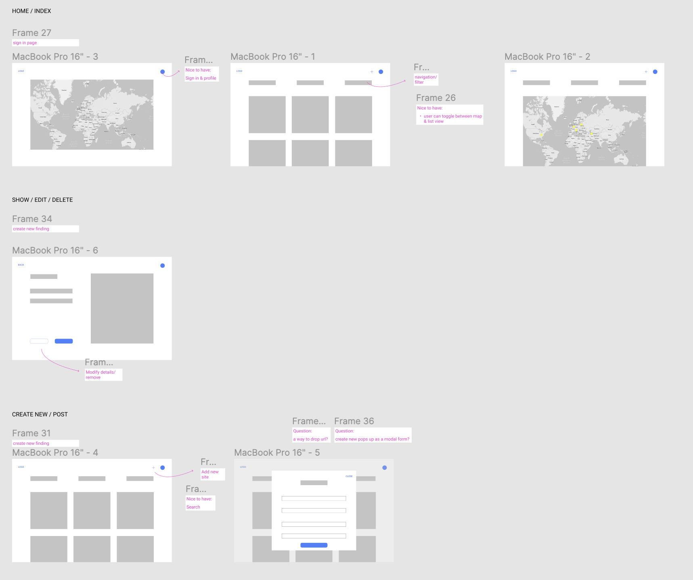

# Architecture Index
Full Stack Responsive Web Application for travel and archiving architecture around the world to visit or stay at.

## MVP

- [x] Technology:
    - Node.js
    - Mongoose
    - Express
    - EJS
- [x] MVC file structure
- [x] A model with 7 RESTful routes with full CRUD

## *Extra*

- [x] EJS Partials
- [x] Visit counter

### Wireframes

### Next steps:

- [ ] Map
- [ ] User authentication
- [ ] Notes
- [ ] Search

